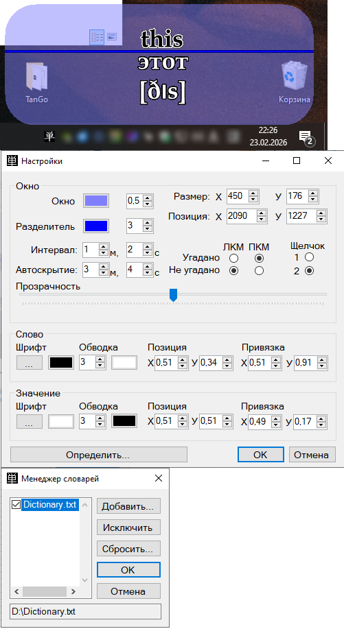

# TanGo
 <b>Программа для повторения иностранных слов.</b> 
  
 Программа находится в системном трее (рядом с часами) и периодически показывает слова из подключённого словаря в случайном порядке, а по щелчку мыши в области окна показывает значение слова. 
 Если пользователь угадал значение, то нажимает левую кнопку мыши, если нет - правую (или наоборот в зависимости от настроек). 
 Если слово угадано, программа помечает его в словаре и более оно выдаваться не будет до тех пор пока весе слова в словаре не будут угаданы. 
 Как только все слова в словаре будут угаданы, словарь обновляется и всё начинается сначала. 
 Если подключено несколько словарей, то программа выдаёт слова по очереди из каждого словаря, но слова внутри словаря выбираются случайным образом (среди тех что ещё не угаданы). 
 В качестве словаря используется текстовый файл в формате UTF-8 без BOM. 
 ==========пример словаря========== 
 \~UTF-8 without BOM;
 \~комментарий;
 \~разделитель между словом и значением - тильда (\~);
 \~перенос на новую строку - обратная кавычка (`);
 \~символом @ программа помечает угаданные слова;
 room\~комната
 chair\~стул`[tʃɛː]
 table\~стол
 book\~книга
 this\~этот`[ðɪs]
 
 ================================ 
 По всем вопросам обращаться: Jack0v@mail.ru 
